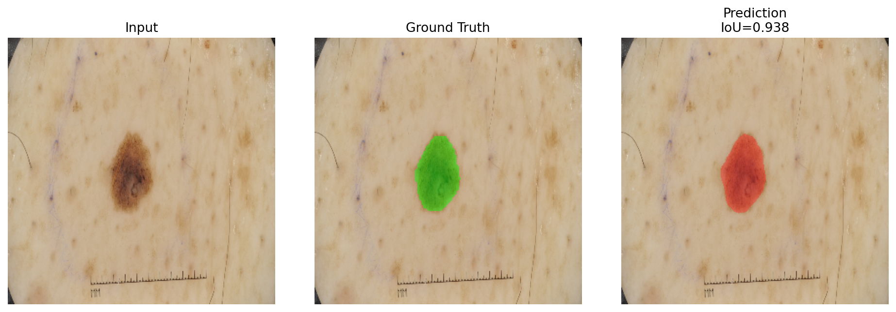
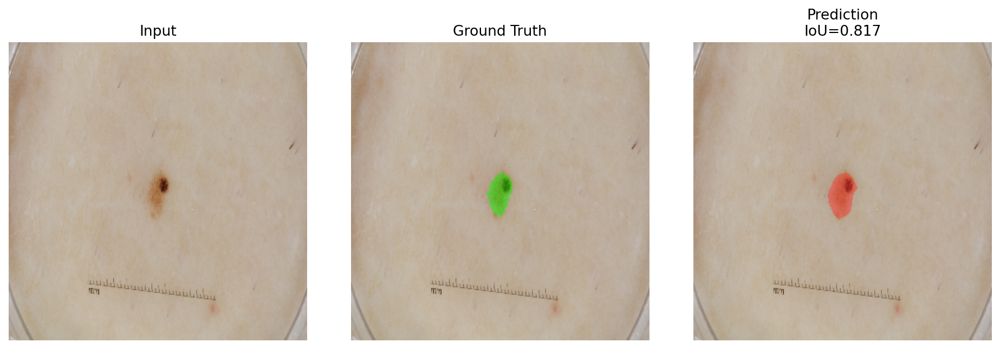

# DermaSeg

DermaSeg is a medical image segmentation project focused on skin lesion segmentation with deep learning. The project is built around the ISIC 2018 lesion segmentation task and is structured to show practical experimentation across classic CNNs, attention-based models, transformer-based models, and promptable foundation-model baselines.

## Project Goal

The point of this repository is not just to train a single model. It is to build a serious segmentation project that shows:

- supervised medical segmentation on a real dataset with ground-truth masks
- comparison across multiple model families
- reproducible training, validation, and test workflows
- room for extensions such as SAM, MedSAM, and newer hybrid approaches

## Methods Implemented

### Supervised segmentation models

- U-Net
- Attention U-Net
- SegNet
- U-Net++
- DeepLabV3
- SwinUNetLite
- SegFormerLite

### Promptable foundation-model track

- SAM
- MedSAM

The promptable models are kept separate from the supervised training track so the comparisons stay honest. They are useful here as project extensions, not as direct replacements for mask-supervised training.

## Dataset

The main project dataset is ISIC 2018 Task 1 for lesion boundary segmentation.

Official sources:

- [ISIC data page](https://challenge.isic-archive.com/data/)
- [ISIC 2018 lesion segmentation task](https://challenge.isic-archive.com/landing/2018/45/)

Supported layouts:

- `data/isic2018/images` and `data/isic2018/masks`
- `data/isic2018/ISIC2018_Task1-2_Training_Input` and `data/isic2018/ISIC2018_Task1_Training_GroundTruth`
- the full official split with train, validation, and test folders

If the official validation and test folders are present, the training pipeline uses that split automatically.

## Project Structure

- `scripts/train.py`: main training, validation, and test entrypoint
- `scripts/evaluate_promptable.py`: SAM and MedSAM evaluation path
- `scripts/summarize_metrics.py`: converts saved metrics into a Markdown summary
- `src/data/`: dataset loaders and preparation utilities
- `src/models/`: segmentation architectures
- `src/utils/`: losses, metrics, and prompting helpers
- `runs/`: checkpoints and metrics written by experiments
- `results/`: summarized experiment outputs for the repo

## Training Workflow

Install dependencies:

```bash
pip install -r requirements.txt
```

Train a baseline U-Net:

```bash
python scripts/train.py --dataset isic --model unet
```

Train a stronger pretrained RGB baseline:

```bash
python scripts/train.py --dataset isic --model deeplabv3 --pretrained
```

Train a transformer-based model:

```bash
python scripts/train.py --dataset isic --model swin_unet --pretrained
```

Promptable evaluation:

```bash
python scripts/evaluate_promptable.py --model sam --checkpoint /path/to/checkpoint.pth
```

## Experiment Philosophy

This repository is organized like a real project rather than a one-off notebook dump. The focus is:

- reproducible runs with saved checkpoints and metrics
- comparing segmentation architectures on the same medical task
- keeping classical supervised models and foundation-model experiments clearly separated
- building a repo that can evolve into stronger experiments instead of freezing at a single result

## Our Approach

For the current ISIC experiment, the project uses a supervised 2-class segmentation setup: lesion vs background.

- dataset: official ISIC 2018 Task 1 split
- model: `DeepLabV3` with a `ResNet-50` backbone and ASPP segmentation head
- input: RGB dermoscopic images resized to `320 x 320`
- loss: combined cross-entropy and Dice loss
- model selection: best validation threshold Jaccard

We used DeepLabV3 here because it gives the project a strong non-U-Net baseline. The version in this repo is the torchvision `deeplabv3_resnet50` architecture: a pretrained ResNet-50 encoder feeding a DeepLabV3 head with atrous convolutions and ASPP to capture multi-scale context. That is useful for skin lesions with irregular shapes and variable sizes, and it transfers well to ISIC because the dataset is 2D RGB and benefits from pretrained natural-image features.

## Current Results

The first completed ISIC experiment is a pretrained `DeepLabV3` run using a ResNet-50 backbone and ASPP head on the official ISIC 2018 split.

- best validation Dice: `0.8900`
- best validation IoU: `0.8134`
- best validation threshold Jaccard: `0.7598`
- test Dice: `0.8782`
- test IoU: `0.7991`
- test threshold Jaccard: `0.7320`

This gives the repo one real completed medical-segmentation result from a local run, not a copied leaderboard number. A short experiment summary is saved in `results/isic_experiments.md`.

### Qualitative Examples

The panels below show input image, ground-truth mask overlay, and predicted mask overlay from the saved `DeepLabV3` checkpoint on the ISIC test split.




## Outputs

Each supervised run writes artifacts under:

```text
runs/<dataset>/<model>/
```

That directory contains:

- `best.pt`
- `last.pt`
- `metrics.json`

You can turn completed runs into a project summary with:

```bash
python scripts/summarize_metrics.py
```
