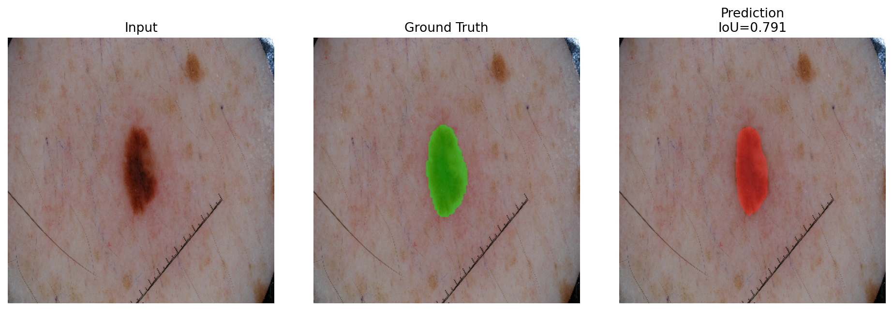
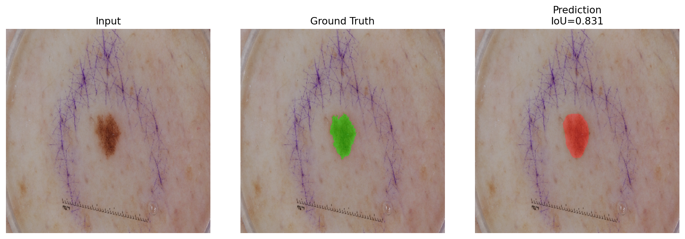

# ISIC Experiment Summary

Current completed run:

- dataset: `ISIC 2018 Task 1`
- model: `DeepLabV3`
- setup: pretrained RGB backbone, official train/validation/test split
- best validation threshold Jaccard: `0.7598`
- final test threshold Jaccard: `0.7320`

| Model | Best Val Dice | Best Val IoU | Best Val TJ | Test Dice | Test IoU | Test TJ |
| --- | ---: | ---: | ---: | ---: | ---: | ---: |
| deeplabv3 | 0.8900 | 0.8134 | 0.7598 | 0.8782 | 0.7991 | 0.7320 |

## Completed Ablation Work

The repo now includes two completed deeper experiment tracks built on top of this baseline:

- `deeplabv3` loss ablation: `ce_dice`, `ce_tversky`, `ce_focal_tversky`
- `ba_deeplabv3` loss ablation: `ce_dice`, `ce_tversky`, `ce_focal_tversky`
- `deeplabv3` learning-rate ablation with fixed `ce_tversky`
- `ba_deeplabv3` learning-rate ablation with fixed `ce_tversky`

These runs are launched through:

```bash
./scripts/run_full_isic_ablation.sh
```

Saved outputs:

- run artifacts: `runs/ablations/`
- summaries: `results/ablations/`

The research takeaway from the completed sweep is that the boundary-aware and Tversky-family runs are useful as controlled experiments on contour sensitivity, even though the plain `DeepLabV3 + CE+Dice` baseline remained the strongest completed configuration in this pass.

## Best Ablation Results

| Track | Best Configuration | Test Dice | Test IoU | Test TJ |
| --- | --- | ---: | ---: | ---: |
| Baseline | `DeepLabV3 + CE+Dice` | 0.8749 | 0.7946 | 0.7375 |
| Boundary-aware | `BA-DeepLabV3 + CE+Tversky + lr=1e-3` | 0.8603 | 0.7707 | 0.6978 |

Full saved summaries:

- `results/ablations/deeplabv3_loss_ablation.md`
- `results/ablations/ba_deeplabv3_loss_ablation.md`
- `results/ablations/deeplabv3_lr_ablation.md`
- `results/ablations/ba_deeplabv3_lr_ablation.md`
- `results/ablations/combined_isic_ablation.md`

## Qualitative Results

Each panel shows:

- left: input dermoscopic image
- middle: ground-truth lesion mask overlay
- right: DeepLabV3 prediction overlay




